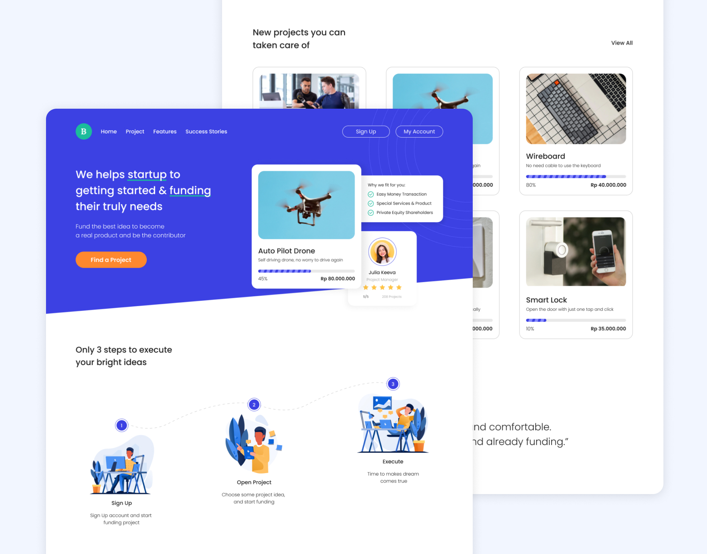

# Bwastartup Crowdfunding



Golang course from BuildWithAngga platform with architectural changes using Clean Architecture.

## Getting Started

### Installation

Start with cloning this repo on your local machine :

```
$ git clone https://github.com/aryahmph/bwastartup-crowdfunding
$ cd bwastartup-crowdfunding
```

To install and set up the library, run:

```
$ go get .
```

### Serving the app

#### Development

```
$ go run main.go
```

#### Production

You need to build the source code first.

```
$ go build
$ ./main
```

Connect to http://localhost:8080/

### API Specification

We use swag to document our API, see swag documentation [here](https://github.com/swaggo/swag)

Open http://localhost:8080/swagger/index.html to view api spec.

### Run test

To run the unit test, you must change directory to package name of test.

```
$ go test -v
```
